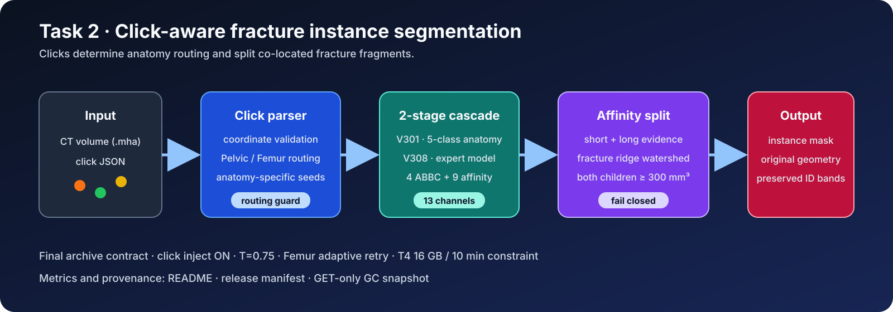
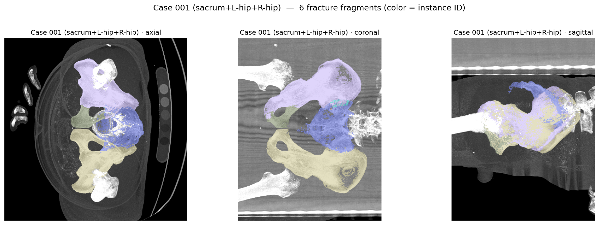

# PENGWIN 2026 — Task 2 클릭 기반 골절 조각 분할

[](LICENSE)
[](#1-과제와-최종-보존-상태)
[](#7-빌드와-검증)
[](#8-전체-submission-snapshot)

Task 1의 fracture-instance cascade에 `peripelvic-fragment-clicks.json`을 결합하는 interactive
segmentation 컨테이너다. 클릭은 단순 표시가 아니라 anatomy family를 확정하고, 같은 예측 instance
안에 여러 클릭이 들어온 경우 학습된 affinity를 이용해 골절 조각을 다시 분리하는 데 사용된다.
이 저장소는 원본 release `v3.7@5b8a228`을 기준으로 정리한 대회 종료 보존본이다.



## 목차

1. [과제와 최종 보존 상태](#1-과제와-최종-보존-상태)
2. [최종 GC 결과](#2-최종-gc-결과)
3. [전체 파이프라인](#3-전체-파이프라인)
4. [클릭과 affinity split](#4-클릭과-affinity-split)
5. [Task 1과의 관계](#5-task-1과의-관계)
6. [입출력·저장소 구조](#6-입출력저장소-구조)
7. [빌드와 검증](#7-빌드와-검증)
8. [전체 submission snapshot](#8-전체-submission-snapshot)
9. [재현성 경계](#9-재현성-경계)

## 1. 과제와 최종 보존 상태

| 항목 | 최종 보존값 |
|---|---|
| 과제 | point prompt를 이용한 3D fracture instance segmentation |
| 입력 | CT `.mha` + click JSON |
| 출력 | 입력 CT와 동일 geometry의 instance label `.mha` |
| source 기준 | immutable tag `v3.7`, commit `5b8a228` |
| base cascade | V301 anatomy + V308 Sacrum/Hip/Femur experts |
| Stage B 출력 | 4 ABBC + 9 affinity = 13 channels |
| click 정책 | inject ON, family routing + affinity split |
| decoder | 기본 `T=0.75`, Femur ridge/adaptive decode |
| 모델 | Task 1 final payload 공유, SHA-256 `049c38ea…2919` |
| 사용자 지정 Final 대표 | `harp3133t`, 10/28, MP 12.4, comment 없음 |
| 로컬 v3.7 관측 | `ruruguru`, Preliminary 25/36, MP 18.8 |

Task 2 Final의 `harp3133t` 행에는 comment가 없어 API만으로 코드 version을 결정할 수 없다.
따라서 `v3.7`을 그 Final 실행의 정확한 source라고 주장하지 않고, 로컬에서 재현 가능한 최종 release로
구분한다.

## 2. 최종 GC 결과

GET-only snapshot `20260818T140325Z`에서 확인한 사용자 지정 Final 대표 행이다.

| 축 | 지표 | 값 | 방향 |
|---|---|---:|:---:|
| overlap | Fragment Dice | 0.8803 | ↑ |
| overlap | Fragment Local Dice | 0.8709 | ↑ |
| surface | HD95 | 11.0982 mm | ↓ |
| surface | ASSD | 3.0629 mm | ↓ |
| instance | Recall | 0.8909 | ↑ |
| instance | Precision | 0.9122 | ↑ |
| instance | F1 | 0.8902 | ↑ |
| topology | Merge error count | 0.3042 | ↓ |
| topology | Split error count | 0.0625 | ↓ |
| topology | Topology consistency | 0.8188 | ↑ |
| leaderboard | Mean Position | 12.4 | ↓ |

평가 ID는 `319ba35c-1ba9-4e2b-886b-7cb767dd688a`, submission ID는
`6bcf8934-782e-42f5-8071-d27f25366597`이며 160/160 case가 성공했다. `10/28`은
account/submission 행 순위이지 공식 중복 제거 team rank가 아니다.

## 3. 전체 파이프라인

```text
CT + click JSON
  │
  ├─ click parser
  │    ├─ 좌표와 label name 검증
  │    └─ Femur click 존재 여부로 family 확정
  │
  ├─ V301 anatomy segmentation
  │
  ├─ anatomy ROI + V308 expert
  │    └─ 4 ABBC + 9 short/long affinity
  │
  ├─ 기본 affinity agglomeration T=0.75
  │
  ├─ 동일 instance 안의 다중 click 탐지
  │    └─ ridge terrain + watershed split
  │
  ├─ 두 자식 모두 300 mm³ 이상인지 확인
  │    └─ 실패하면 원래 label 유지
  │
  └─ 원본 CT geometry와 ID band로 복원
```

## 4. 클릭과 affinity split

클릭 분할은 fail-closed 계약을 사용한다.

1. click name에서 anatomy와 fragment hint를 읽는다.
2. 같은 예측 instance에 서로 다른 fragment click이 두 개 이상 들어갔는지 확인한다.
3. short 3채널과 long-offset 6채널 affinity로 separation terrain을 만든다.
4. Femur에서는 fracture ridge seed를 추가할 수 있다.
5. watershed의 두 자식이 각각 300 mm³보다 작으면 split을 취소한다.
6. affinity가 없거나 입력이 불완전하면 원래 segmentation을 그대로 반환한다.

이 계약은 작은 false fragment가 늘어나는 것을 막고, click이 없는 영역의 Task 1 결과를 임의로
바꾸지 않는다.

## 5. Task 1과의 관계



위 이미지는 click 적용 전 base cascade의 정성 예시다. Task 2 고유 개선을 주장하는 비교 그림이
아니다.

Task 2는 별도 대형 segmentation network를 학습하지 않고 Task 1의 V301/V308 payload를 공유한다.
Task 2 고유 코드는 click parsing, family override와 affinity-guided split이다. 공유 모델 archive는
Task 1 release asset에 있으며, Task 2 전체 snapshot에는 중복된 1.4GB model tar를 넣지 않는다.

## 6. 입출력·저장소 구조

```text
.
├── inference/
│   ├── inference.py              Task 2 GC entrypoint
│   ├── task1_pipeline.py         보존된 Task 1 cascade
│   └── click_split_affinity.py   click-aware watershed split
├── code_task1/                   trainer discovery에 필요한 구현
├── assets/                       pipeline와 base example
├── Dockerfile
├── requirements.txt
└── scripts/build_image.sh
```

컨테이너는 `/input`의 CT와 click JSON을 읽고 `/output`에 segmentation을 기록한다. GC T4 16GB,
case당 10분, network-disabled 조건을 전제로 한다.

## 7. 빌드와 검증

```bash
bash scripts/build_image.sh
```

로컬 project root의 CPU 회귀 테스트:

```bash
PYTHONDONTWRITEBYTECODE=1 /opt/miniconda3/envs/pengwin_v2/bin/python \
  -m unittest discover -s code_task2/tests -v
```

현재 테스트는 missing affinity fallback, preprocessed voxel volume에 따른 300 mm³ 변환,
fracture ridge의 단조성, short/long affinity 사용을 검증한다. Docker ENV 25개는 원본 v3.7과
effective value 기준으로 동일함을 확인했다. 컨테이너 rebuild, GPU forward와 공식 evaluator는
이번 보존 작업에서 다시 실행하지 않았다.

## 8. 전체 submission snapshot

코드, 평가 기록과 release manifest를 포함한 전체 Task 2 보존본은 GitHub Release
`competition-final-20260819`에 있다.

- [전체 Task 2 submission archive](https://github.com/RURUGURU/pengwin2026-task2-interact/releases/download/competition-final-20260819/submission_task2_competition_final_20260819.tar.gz)
- [SHA-256 checksum](https://github.com/RURUGURU/pengwin2026-task2-interact/releases/download/competition-final-20260819/submission_task2_competition_final_20260819.tar.gz.sha256)
- [공유 Task 1 모델 archive](https://github.com/RURUGURU/pengwin2026-task1-abbc/releases/download/competition-final-20260819/submission_task1_competition_final_20260819.tar.gz)

Task 2 snapshot은 `submission_task2/github_repo/.git`만 제외한다. 공유 모델의 exact tar는 Task 1
snapshot 안에 한 번만 보존한다.

## 9. 재현성 경계

- `harp3133t` Final 행의 version은 API로 확정할 수 없다.
- 로컬 `v3.7`은 Preliminary에서만 직접 관측됐다.
- GC model object와 Task 1 공유 tar의 byte binding은 제공되지 않는다.
- displayed rank는 account/submission 행 기준이며 공식 deduplicated team rank가 아니다.
- 정성 이미지는 파이프라인 설명용이고 metric의 원자료가 아니다.

세부 ID, hash와 미실행 검증은 전체 snapshot의 `RELEASE_MANIFEST.json`에서 확인할 수 있다.
